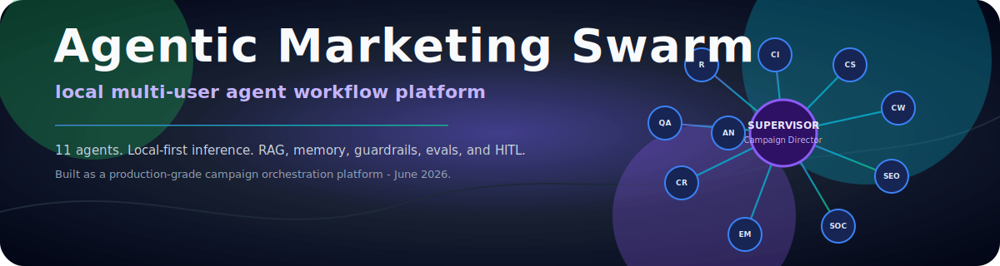
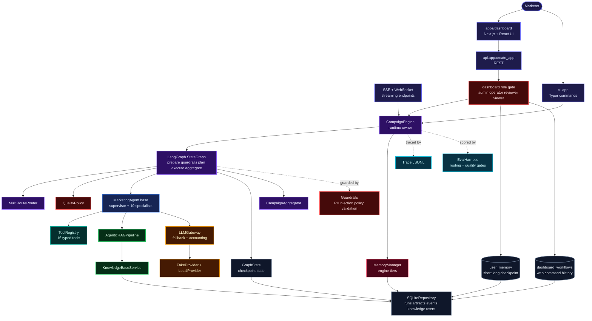
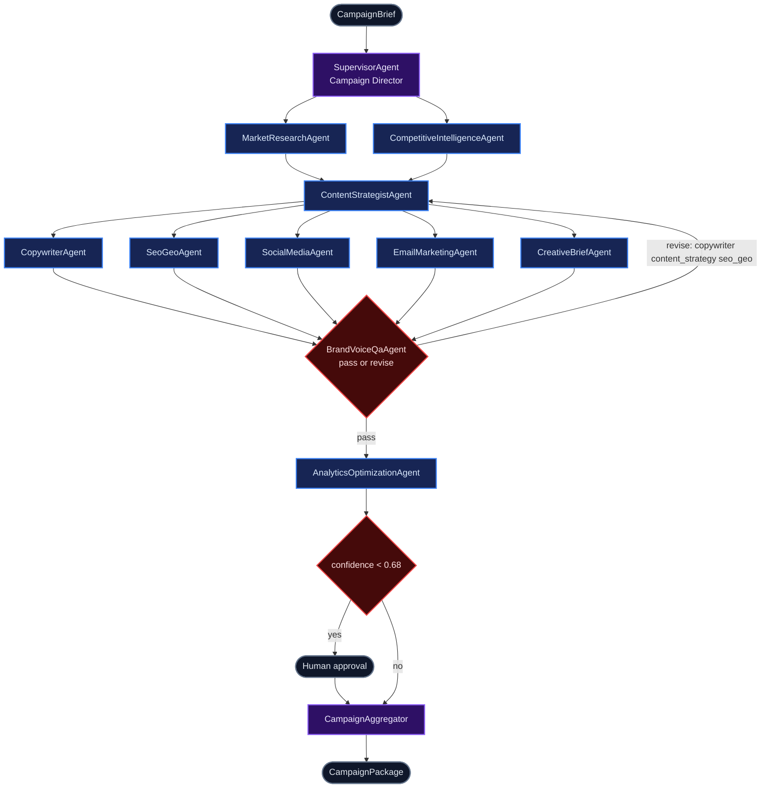
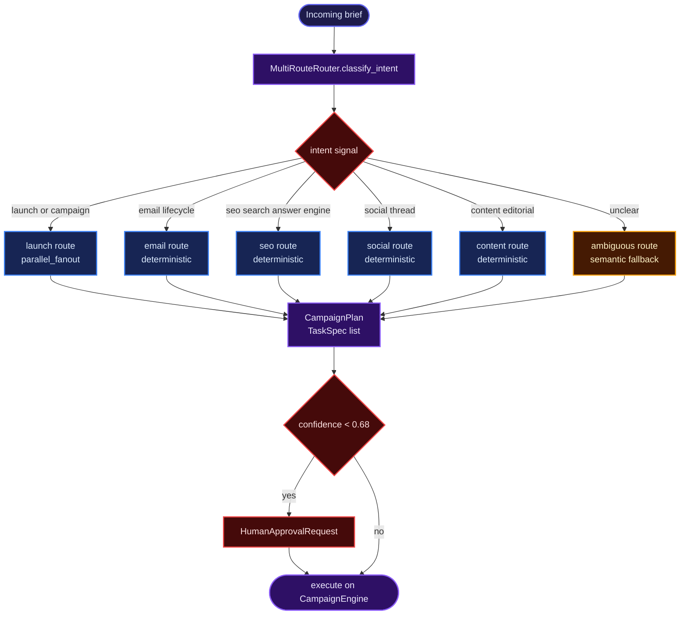
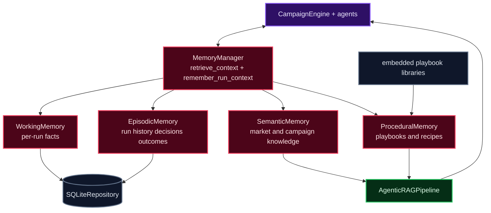
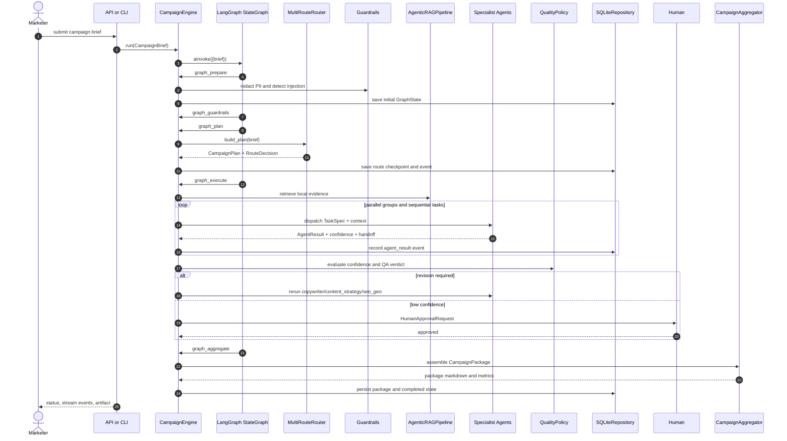
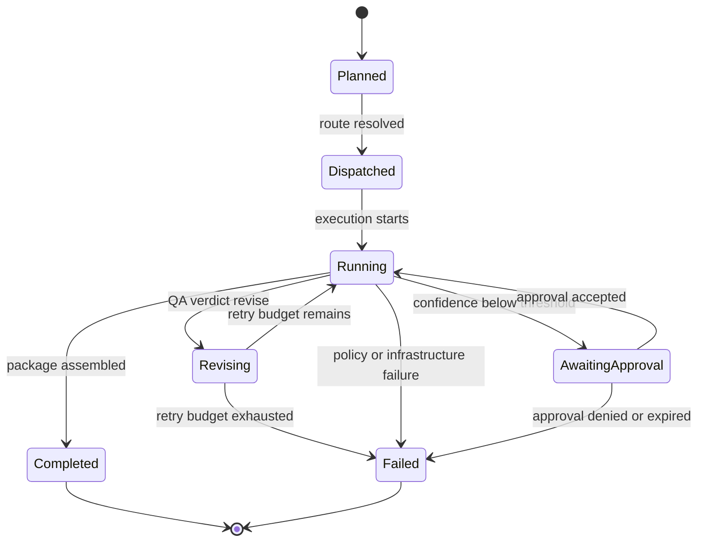
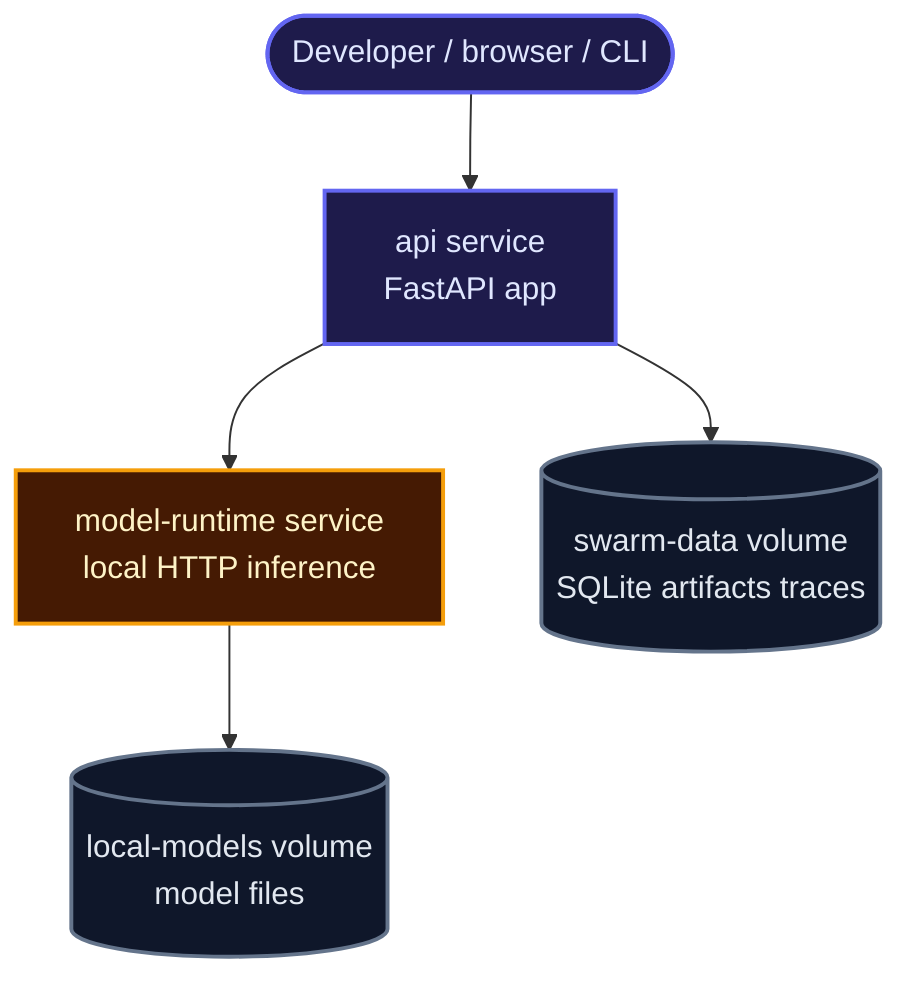

<p align="center">
  
</p>

<p align="center">
  
  
  
  
  
  
  
</p>

Agentic Marketing Swarm is a local-first 11-agent workforce for marketing workflows: one supervisor agent and ten specialist agents turn a high-level campaign brief into a traceable campaign package with strategy, research, content, copy, search guidance, lifecycle messaging, creative briefs, QA verdicts, and optimization plans. Built for June 2026 review, it pairs LangGraph orchestration, a modern multi-user dashboard, grounded retrieval, user memory, guardrails, observability, and eval gates with a zero-required-cost stack that can run on a single laptop.

## Why This Exists

Coordinating many specialist agents reliably is an orchestration problem, not a prompt-writing problem. This project treats each campaign as a compiled LangGraph `StateGraph` with typed tasks, deterministic and semantic routing, bounded quality loops, confidence thresholds, and human approval gates. Every model call, tool result, route decision, memory read, user command, and artifact is structured so a reviewer can replay what happened and why. The default runtime avoids paid APIs, paid vector databases, paid auth services, and cloud dependencies while still preserving the interfaces needed to swap providers, stores, and deployment shapes later.

## Highlights

- **11-agent workforce:** one Campaign Director plus Research, Competitive Intelligence, Content Strategy, Copywriting, SEO/GEO, Social, Email, Creative Brief, Brand Voice/QA, and Analytics specialists.
- **LangGraph orchestration:** `StateGraph` nodes for `prepare`, `guardrails`, `plan`, `execute`, and `aggregate` coordinate the workflow through explicit conditional edges.
- **Multi-mode routing:** deterministic intent routes, semantic fallback, parallel fan-out/fan-in, sequential dependency chains, typed A2A handoffs, QA cycles, and HITL escalation.
- **Agentic RAG:** query rewriting, local vector embeddings, BM25 lexical search, Reciprocal Rank Fusion, reranking, relevance grading, and citation handoff.
- **Two memory planes:** engine memory uses working, semantic, episodic, and procedural tiers; dashboard user memory uses short, long, and checkpoint scopes persisted per user.
- **Modern user dashboard:** Next.js, React, TypeScript, and JavaScript UI for role-based multi-user agent commands, workflow history, result retrieval, and memory inspection.
- **Typed local tools:** validated tools for research, search, reranking, SEO scoring, readability, tone, personas, calendars, rendering, claims, PII redaction, validation, routing, and experiments.
- **Knowledge-base ingestion:** import Markdown, text, JSON, JSONL, and CSV into SQLite-backed chunks that can be searched through the same RAG path.
- **Full observability:** JSON logs, trace spans, metrics snapshots, route history, and persisted run events.
- **Eval gates:** deterministic golden cases for routing accuracy, package quality, and guardrail efficacy.

> [!IMPORTANT]
> The project is designed to run with no required API keys, business account, paid SaaS, or cloud database. The deterministic local provider powers tests and demos; an optional local model runtime adapter is available behind the provider-agnostic gateway.

## Table Of Contents

- [Architecture](#architecture)
- [Technology Stack](#technology-stack)
- [The Workforce](#the-workforce)
- [Routing Modes](#routing-modes)
- [Quickstart](#quickstart)
- [User Dashboard](#user-dashboard)
- [Memory Model](#memory-model)
- [Configuration](#configuration)
- [API Reference](#api-reference)
- [Observability](#observability)
- [Evaluation](#evaluation)
- [Project Layout](#project-layout)
- [Roadmap](#roadmap)
- [Contributing](#contributing)
- [License And Author](#license-and-author)

## Architecture

### Figure 1 - System Architecture



**Figure 1 - System Architecture.** The system is layered around `CampaignEngine`, which owns a compiled LangGraph `StateGraph` for the core workflow. The graph calls runtime node methods for preparation, guardrails, planning, execution, and aggregation while the engine provides routing, policy, agents, memory, retrieval, package synthesis, and persistence. The web dashboard talks to FastAPI dashboard endpoints, FastAPI enforces simple role gates, and SQLite stores users, user memory, workflow history, runs, artifacts, events, knowledge chunks, and checkpoints. Persistence is local and inspectable through SQLite plus JSONL traces, keeping the system runnable without managed infrastructure or paid services.

### Figure 2 - Agent Orchestration Topology



**Figure 2 - Agent Orchestration Topology.** The topology mirrors the implementation: launch plans run discovery agents, feed strategy, fan out into production specialists, then pass through QA and analytics. The QA loop is bounded by `MARKETING_SWARM_QA_REVISION_LIMIT` and targets the actual upstream agents used in code: `copywriter`, `content_strategy`, and `seo_geo`. Human approval is triggered by the quality policy when confidence falls below the configured threshold or failures are present.

### Figure 3 - Multi-Mode Routing Decision Flow



**Figure 3 - Routing.** `MultiRouteRouter` classifies intent from the brief, selects an ordered agent list from routing tables, attaches parallel groups, and records a `RouteDecision` with mode, reason, confidence, and metadata. Known campaign types follow deterministic paths; ambiguous briefs use semantic fallback and may pause for HITL when confidence drops below the configured floor. The resulting `CampaignPlan` is persisted before any agent work begins.

### Figure 4 - Agentic RAG And Knowledge Ingestion

```mermaid
flowchart LR
    classDef iface fill:#1e1b4b,stroke:#6366f1,stroke-width:2px,color:#e0e7ff
    classDef orch  fill:#2e1065,stroke:#8b5cf6,stroke-width:2px,color:#ede9fe
    classDef agent fill:#172554,stroke:#3b82f6,stroke-width:2px,color:#dbeafe
    classDef tool  fill:#042f2e,stroke:#14b8a6,stroke-width:2px,color:#ccfbf1
    classDef llm   fill:#451a03,stroke:#f59e0b,stroke-width:2px,color:#fef3c7
    classDef rag   fill:#052e16,stroke:#22c55e,stroke-width:2px,color:#dcfce7
    classDef mem   fill:#4c0519,stroke:#f43f5e,stroke-width:2px,color:#ffe4e6
    classDef gate  fill:#450a0a,stroke:#ef4444,stroke-width:2px,color:#fee2e2
    classDef obs   fill:#083344,stroke:#06b6d4,stroke-width:2px,color:#cffafe
    classDef store fill:#0f172a,stroke:#64748b,stroke-width:2px,color:#e2e8f0

    FILES["Markdown / text / JSON / JSONL / CSV"]:::iface
    LOAD["LocalKnowledgeLoader"]:::rag
    CHUNK["TextChunker<br/>target tokens + overlap"]:::rag
    KS["KnowledgeSource<br/>KnowledgeChunk"]:::store
    SQL[("SQLite knowledge tables")]:::store
    QUERY([Agent query]):::agent
    REWRITE["rewrite_query"]:::rag
    DENSE["HashingEmbeddingModel<br/>vector search"]:::rag
    BM25["BM25Index<br/>lexical search"]:::rag
    RRF["reciprocal_rank_fusion"]:::rag
    RERANK["CrossFeatureReranker"]:::rag
    CITE["SearchResult<br/>citation-ready context"]:::rag

    FILES --> LOAD --> CHUNK --> KS --> SQL
    QUERY --> REWRITE
    SQL --> DENSE
    SQL --> BM25
    REWRITE --> DENSE --> RRF
    REWRITE --> BM25 --> RRF
    RRF --> RERANK --> CITE
```



**Figure 4 - Agentic RAG And Knowledge Ingestion.** `KnowledgeBaseService` normalizes files, chunks them with overlap, persists sources and chunks, and searches them through the same retrieval stack used by agents. Retrieval is hybrid: deterministic hashing vectors provide dense similarity, BM25 provides lexical precision, RRF fuses ranks, and `CrossFeatureReranker` rescales by overlap, title match, and evidence depth. The output is citation-ready context that tools and agents can carry forward.

### Figure 5 - Four-Tier Memory Architecture



**Figure 5 - Engine Memory.** The engine memory layer is split by lifespan and purpose. Working memory holds active run context, semantic memory stores durable campaign knowledge, episodic memory captures decisions and outcomes, and procedural memory is seeded from generated playbook libraries. Agents ask `MemoryManager` for context instead of directly reaching into tiers, keeping consolidation and retrieval policy centralized. This is separate from dashboard user memory, which is persisted per UI user and explained in the Memory Model section.

### Figure 6 - Request Lifecycle



**Figure 6 - Request Lifecycle.** A run enters `CampaignEngine.run()`, which invokes the compiled LangGraph `StateGraph`. The graph steps through `prepare`, `guardrails`, `plan`, `execute`, and `aggregate`; conditional edges stop early on policy failure or approval checkpoints. PII redaction and injection checks happen before routing or agent dispatch, the plan is persisted, evidence is retrieved, parallel and sequential agent tasks are recorded, QA revision or HITL pause is handled, and the package is synthesized only after execution completes. The same flow serves the API, streaming endpoints, and CLI because they all enter through `CampaignEngine`.

### Figure 7 - Run State Machine



**Figure 7 - Run State Machine.** The state machine maps to `RunStatus` and `GraphState`: planned, dispatched, running, awaiting approval, revising, completed, and failed. Because `SQLiteRepository.save_state` is called at critical transitions, a run can be inspected from a known checkpoint boundary. The revision path is bounded, and policy failures are stamped so operators can distinguish model, tool, validation, policy, and infrastructure issues.

### Figure 8 - Local Deployment Topology



**Figure 8 - Deployment.** The checked-in compose file runs two services: the API container and a local model-runtime container, with named volumes for run data and model files. SQLite persists campaign runs, artifacts, events, knowledge sources, chunks, and checkpoints; traces are written as JSONL. The same project can also run without containers via editable Python install and the deterministic local provider.

## Technology Stack

| Layer | Stack |
|---|---|
| Agent orchestration | LangGraph `StateGraph` from the LangChain ecosystem, Python async runtime, typed conditional edges |
| Backend API | FastAPI, Pydantic, Typer CLI, SSE, WebSocket run submission |
| Agent workforce | 11 agents total: one supervisor plus ten specialist sub-agents for research, strategy, copy, search, social, email, creative, QA, and analytics |
| Retrieval and embeddings | Local hashing embeddings, BM25 lexical search, Reciprocal Rank Fusion, reranking, citation handoff |
| Memory | Engine working, semantic, episodic, and procedural tiers plus dashboard `short`, `long`, and `checkpoint` user memory |
| Persistence | SQLite runs, artifacts, events, users, workflow history, user memory, knowledge chunks, and checkpoints |
| Web dashboard | Next.js App Router, React, TypeScript, JavaScript route handlers, role-based multi-user UI |
| Quality and evals | Deterministic eval harness, routing accuracy checks, package completeness gates, guardrail tests |
| Observability | JSONL traces, metrics snapshots, route history, persisted event stream |

## The Workforce

| Agent | Role | Consumes | Produces | Tools |
|---|---|---|---|---|
| Supervisor / Campaign Director | Classifies intent, decomposes work, chooses route mode, enforces gates, and synthesizes the package. | Brief, route history, confidence scores, quality signals | Route decision, campaign plan, HITL request, final synthesis | `route_classifier`, `artifact_validator`, `pii_redactor`, `template_renderer` |
| Market Research Agent | Builds audience segments, personas, market narrative, and demand signals. | Brief, local evidence, procedural memory | Audience segments, personas, market narrative, demand signals | `research_corpus`, `hybrid_search`, `persona_synthesizer`, `claim_extractor` |
| Competitive Intelligence Agent | Maps alternatives, SWOT, differentiation, and comparison frames. | Brief, retrieved evidence, research outputs | Competitor map, SWOT, differentiation angles, comparison table | `research_corpus`, `hybrid_search`, `reranker`, `claim_extractor` |
| Content Strategist Agent | Designs funnel architecture, content pillars, calendar, and message hierarchy. | Research, competitive context, channel goals | Content pillars, funnel map, editorial calendar, messaging hierarchy | `calendar_builder`, `template_renderer`, `keyword_seo_scorer`, `artifact_validator` |
| Copywriter Agent | Produces headlines, landing-page copy, ad variants, value props, and CTAs. | Strategy, tone constraints, evidence summaries | Headline bank, landing-page copy, ad variants, CTA matrix | `readability_analyzer`, `tone_sentiment_analyzer`, `template_renderer`, `artifact_validator` |
| SEO / GEO Agent | Clusters keywords, maps intent, plans on-page improvements, and optimizes answer-engine citation readiness. | Strategy, copy, evidence, search terms | Keyword clusters, intent map, on-page plan, answer-engine plan | `keyword_seo_scorer`, `hybrid_search`, `reranker`, `claim_extractor` |
| Social Media Agent | Builds channel-specific posts, hooks, cadence, and ready-to-publish specs. | Brief, strategy, copy inputs, tone constraints | Post specs, hook library, cadence plan, platform matrix | `calendar_builder`, `tone_sentiment_analyzer`, `readability_analyzer`, `template_renderer` |
| Email Marketing Agent | Builds lifecycle sequences, subject lines, segmentation logic, and send cadence. | Personas, funnel stage, messaging hierarchy | Welcome sequence, nurture sequence, subject lines, segmentation logic | `readability_analyzer`, `tone_sentiment_analyzer`, `template_renderer`, `artifact_validator` |
| Creative Brief Agent | Writes visual briefs, storyboards, prompt specs, and art direction. | Brand constraints, campaign angle, channel mix | Visual briefs, storyboards, prompt specs, art direction | `template_renderer`, `tone_sentiment_analyzer`, `artifact_validator`, `pii_redactor` |
| Brand Voice & QA Agent | Checks tone, claim risk, PII, consistency, and revise/pass verdicts. | Draft assets, claims, tone guidance, citations | QA verdict, claim review, tone review, revision directives | `claim_extractor`, `pii_redactor`, `artifact_validator`, `tone_sentiment_analyzer` |
| Analytics & Optimization Agent | Defines KPI framework, measurement plan, experiments, and optimization roadmap. | Package draft, route metrics, channel plan | KPI framework, measurement plan, experiment backlog, optimization roadmap | `experiment_designer`, `calendar_builder`, `template_renderer`, `artifact_validator` |

## Routing Modes

| Mode | Trigger | Execution Pattern | Why It Matters |
|---|---|---|---|
| Deterministic | Clear brief intent: email, SEO/search, social, content | Routing table selects a fixed ordered agent list | Stable, testable behavior for common campaign requests |
| Semantic fallback | Ambiguous brief with weaker signals | Classifier selects a default broad route and marks lower confidence | Prevents brittle routing while preserving auditability |
| Parallel fan-out/fan-in | Launch or multi-workstream campaign | Discovery and production groups run concurrently, then aggregate | Cuts latency and keeps independent workstreams independent |
| Sequential chain | Strategy-dependent assets | Later agents consume prior outputs through state/context | Keeps content, copy, search, QA, and analytics coherent |
| A2A handoff | Agent result includes peer payload | `AgentResult.handoff` carries target agents and asset ids | Makes delegation explicit rather than hidden in prose |
| HITL escalation | Route or agent confidence below threshold, or failures | `HumanApprovalRequest` pauses the run with checkpoint id | Lets operators approve risky work without losing state |

See **Figure 3** for the route decision flow and **Figure 7** for how low-confidence routes pause inside the run state machine.

## Quickstart

### Prerequisites

- Python 3.11+
- Docker with compose support, optional but recommended for local model runtime
- A local model runtime CLI if you want live local model calls; tests and demos run with the deterministic provider

### Install And Run Locally

```bash
python -m pip install -e ".[dev]"
marketing-swarm kb seed
marketing-swarm kb import ./examples --namespace demo
marketing-swarm kb search "privacy remote workers proof" --namespace demo
marketing-swarm run "Launch a go-to-market campaign for a privacy-first note-taking app aimed at remote knowledge workers." --output runtime/package.md
```

### Optional Local Model Runtime

```bash
ollama pull llama3.1:8b
ollama pull nomic-embed-text
docker compose up --build
```

The checked-in application defaults to deterministic local inference for tests and demo stability. Set `MARKETING_SWARM_LLM_PROVIDER=local` and `MARKETING_SWARM_LOCAL_ENDPOINT=http://localhost:11434` when you want the local runtime adapter to be first in the gateway fallback chain.

### API Smoke Test

```bash
uvicorn marketing_swarm.api.app:create_app --factory --reload --port 8080
curl -X POST http://localhost:8080/runs \
  -H "content-type: application/json" \
  -d "{\"brief\":\"Launch a campaign for a local-first analytics workspace for operations teams.\"}"
```

> [!NOTE]
> The CLI writes runtime files under `runtime/` by default. The compose deployment maps container runtime files to the `swarm-data` named volume.

## User Dashboard

The `apps/dashboard` workspace adds a modern Next.js, React, TypeScript, and JavaScript dashboard on top of the FastAPI service. It supports multiple local users, role-aware command permissions, short-term and long-term user memory, checkpoint memory, workflow history, approval visibility, and result retrieval from the web UI. It does not require a paid auth provider, paid database, hosted queue, business account, or cloud project. See [docs/dashboard.md](docs/dashboard.md) for the endpoint map and local run notes.

```bash
uvicorn marketing_swarm.api.app:create_app --factory --reload --port 8080
cd apps/dashboard
npm install
npm run dev
```

The dashboard defaults to `http://127.0.0.1:8080` for the backend and falls back to demo data if FastAPI is not running. Set `AGENT_DASHBOARD_API_BASE_URL` if the API runs elsewhere.

## Memory Model

The project has two memory planes because the agent runtime and the web dashboard need different lifecycles.

### Engine Memory

Engine memory is coordinated by `MemoryManager` during campaign execution. It is optimized for agent context:

| Tier | Lifespan | Purpose |
|---|---|---|
| Working | Current run | Stores active facts and intermediate context while a workflow is running. |
| Semantic | Durable knowledge | Stores reusable campaign, audience, market, and positioning knowledge. |
| Episodic | Run history | Stores decisions, outcomes, and lessons from previous executions. |
| Procedural | Playbooks | Stores reusable methods, recipes, and workflow patterns. |

### Dashboard User Memory

Dashboard user memory is persisted in SQLite in the `user_memory` table and is keyed by `user_id`, `scope`, `key`, `value`, optional `run_id`, `created_by`, and `created_at`. It is optimized for multi-user continuity and auditability in the web UI:

| Scope | Written When | What It Stores | Why It Matters |
|---|---|---|---|
| `short` | Before a dashboard command runs | Latest command brief, workflow type, priority, channels, and operator memory notes. | Preserves the immediate command context so the UI and workflow can show what the user asked the agent to do. |
| `long` | After a workflow produces a result | Durable campaign summary, quality summary, and routing summary for the selected user. | Gives the user continuity across sessions and keeps reusable outcomes visible without a paid user-profile service. |
| `checkpoint` | After a workflow reaches a LangGraph run boundary | Run id, status, route decision, package id, and approval/checkpoint context. | Makes each workflow traceable and gives reviewers a compact recovery/audit marker for completed, failed, or paused work. |

The command flow writes a `short` record first, attaches recent user memory to the `CampaignBrief.metadata.user_memory_context`, runs the LangGraph-backed agent workflow, then writes `checkpoint` and `long` records with the result. The dashboard bootstrap endpoint returns memory grouped by user, and the React `MemoryPanel` displays the three scopes side by side.

Role access stays simple and local: viewers and reviewers can read memory; operators and admins can write memory and command agents. This is intentionally free infrastructure: SQLite is the memory store, FastAPI is the API boundary, and the dashboard uses local route handlers instead of a managed backend service.

## Configuration

<details>
<summary>Environment variables, model profiles, and backend switches</summary>

| Variable | Default | Purpose |
|---|---|---|
| `MARKETING_SWARM_DB_PATH` | `runtime/marketing_swarm.sqlite3` | SQLite repository for runs, artifacts, events, knowledge, and checkpoints |
| `MARKETING_SWARM_ARTIFACT_DIR` | `runtime/artifacts` | Local artifact output directory |
| `MARKETING_SWARM_LLM_PROVIDER` | `fake` | Gateway-first provider: `fake` for deterministic execution, `local` for local runtime |
| `MARKETING_SWARM_LOCAL_ENDPOINT` | `http://localhost:11434` | Local model runtime endpoint |
| `MARKETING_SWARM_DEFAULT_MODEL` | `local-general` | Default model id for generic calls |
| `MARKETING_SWARM_CONFIDENCE_THRESHOLD` | `0.68` | HITL escalation floor |
| `MARKETING_SWARM_QA_REVISION_LIMIT` | `2` | Bounded QA revision attempts |
| `MARKETING_SWARM_TRACE_PATH` | `runtime/traces.jsonl` | JSONL trace sink |
| `MARKETING_SWARM_LOG_LEVEL` | `INFO` | Structured logging level |
| `AGENT_DASHBOARD_API_BASE_URL` | `http://127.0.0.1:8080` | Backend URL used by the Next.js dashboard route handlers |

Model assignments live in `src/marketing_swarm/config/model_registry.py`. The current registry maps each agent to a local profile with temperature, context window, JSON-mode capability, and zero cost accounting. Routing tables live in `src/marketing_swarm/config/routing_tables.py`; adding a route means adding an intent key, ordered agents, and optional parallel groups.

Persistence is repository-backed. `SQLiteRepository` is the default for runs, events, artifacts, and local knowledge chunks. Retrieval uses embedded hashing vectors plus BM25 by default, so the system can search imported knowledge without a separate vector database service.

</details>

## API Reference

<details>
<summary>REST, streaming, and HITL endpoints</summary>

### Create Run

`POST /runs`

```json
{
  "brief": "Launch a campaign for a privacy-first note app for remote teams.",
  "audience": "remote knowledge workers",
  "goals": ["awareness", "activation"]
}
```

Response:

```json
{
  "run_id": "run_abc123",
  "status": "completed",
  "package_id": "package_def456"
}
```

| Method | Path | Purpose |
|---|---|---|
| `GET` | `/runs` | List recent runs from SQLite |
| `GET` | `/runs/{run_id}` | Return checkpointed `GraphState` |
| `GET` | `/runs/{run_id}/artifact.md` | Return campaign package markdown |
| `GET` | `/runs/{run_id}/events` | Stream server-sent status events |
| `WS` | `/ws/runs` | Submit a brief and receive run status over WebSocket |
| `POST` | `/approvals/{approval_id}` | Record HITL approval status |

```bash
curl -N http://localhost:8080/runs/run_abc123/events
curl -X POST http://localhost:8080/approvals/approval_abc123 \
  -H "content-type: application/json" \
  -d "{\"status\":\"approve\",\"reviewer\":\"local-operator\"}"
```

### Dashboard Endpoints

Dashboard endpoints use lightweight local role headers:

```text
x-user-id: user_admin
x-user-role: admin
```

| Method | Path | Minimum Role | Purpose |
|---|---|---|---|
| `GET` | `/dashboard/bootstrap` | `viewer` | Return users, recent workflows, memory grouped by user, and dashboard capabilities |
| `GET` | `/dashboard/users` | `viewer` | List role-aware dashboard users |
| `GET` | `/dashboard/users/{user_id}/memory` | `viewer` | Return a user's `short`, `long`, and `checkpoint` memory |
| `POST` | `/dashboard/users/{user_id}/memory` | `operator` | Write one user memory record |
| `POST` | `/dashboard/agent/command` | `operator` | Command the agent workforce for a selected dashboard user |
| `GET` | `/dashboard/workflows` | `viewer` | List recent dashboard workflow commands |
| `GET` | `/dashboard/workflows/{run_id}/result` | `viewer` | Return a run, artifact markdown, approvals, and result events |

```json
{
  "user_id": "user_operator",
  "brief": "Launch a comprehensive campaign for a privacy-first workspace.",
  "workflow_type": "comprehensive_campaign",
  "priority": 7,
  "channels": ["content", "email", "search"],
  "approval_required": true,
  "memory_notes": "Prefer proof-led copy and QA checkpoints."
}
```

</details>

## Observability

Trace spans are emitted through `TraceRecorder` to `runtime/traces.jsonl` by default. Metrics are accumulated in `MetricsRegistry` and attached to completed `GraphState.metrics`; route decisions and agent results are persisted as events in SQLite. Logs can be configured as JSON through `marketing_swarm.observability.logging.configure_logging`.

| SLI | Target SLO | Where To Inspect |
|---|---:|---|
| Route decision trace coverage | 100% of runs | `runtime/traces.jsonl`, `events` table |
| Deterministic eval reproducibility | 100% repeatable on local provider | `marketing-swarm eval run --gate` |
| Local smoke run latency | p95 under 2 seconds for deterministic provider | trace duration fields |
| Agent result persistence | 100% of completed agent tasks | `events` table, `GraphState.results` |
| HITL checkpoint durability | 100% of approval pauses saved | `runs.state_json`, approval payload |

## Evaluation

```bash
marketing-swarm eval run --gate
```

The eval harness runs deterministic golden briefs through the full engine and scores route accuracy plus package completeness. Unit tests also cover tools, agents, retrieval, memory, knowledge ingestion, guardrails, orchestration, and the e2e eval gate.

| Metric | Current Sample | Gate |
|---|---:|---:|
| Routing accuracy | `1.000` | `0.800` |
| Package quality | `0.985` | `0.650` |
| Test suite | `23 passed` | all tests pass |
| Real Python lines | `25604` | `>=20000` |

## Project Layout

```text
.
|-- README.md                         # Museum-grade system overview
|-- LICENSE                           # MIT, Shake MD Tareq Hasan, 2026
|-- pyproject.toml                    # Package metadata, deps, lint/test config
|-- docker-compose.yml                # API + local model-runtime services
|-- apps/dashboard/                   # Next.js user dashboard for commanding agents
|-- docs/
|   |-- architecture.md               # Architecture companion doc
|   |-- dashboard.md                  # Web UI, roles, and dashboard API notes
|   |-- memory.md                     # Engine memory and dashboard user memory
|   `-- assets/hero.svg               # Committed hero banner
|-- examples/briefs/                  # Runnable campaign examples
|-- scripts/
|   |-- count_real_lines.py           # Substantive code counter
|   |-- run_demo.py                   # End-to-end demo runner
|   `-- seed_kb.py                    # Local memory seed smoke script
|-- src/marketing_swarm/
|   |-- agents/                       # Base agent plus 1 supervisor and 10 specialists
|   |-- api/                          # REST, SSE, WebSocket, HITL endpoints
|   |-- cli/                          # Typer commands for runs, evals, KB ops
|   |-- config/                       # Settings, model registry, routing tables
|   |-- evals/                        # Golden datasets, scorers, gates
|   |-- guardrails/                   # PII, injection, policy, validation
|   |-- knowledge/                    # Local ingestion, chunking, KB search
|   |-- llm/                          # Provider-neutral gateway and providers
|   |-- memory/                       # Working, semantic, episodic, procedural tiers
|   |-- observability/                # Tracing, metrics, JSON logging
|   |-- orchestration/                # Engine, LangGraph builder, router, policies, aggregator
|   |-- persistence/                  # SQLite repository and checkpoint facade
|   |-- playbooks/                    # Generated procedural playbook libraries
|   |-- retrieval/                    # Embeddings, BM25, RRF, rerank, RAG
|   |-- schemas/                      # Pydantic campaign, state, tool, KB models
|   `-- tools/                        # Typed validated local tool catalog
`-- tests/
    |-- unit/                         # Agents, tools, retrieval, memory, knowledge
    |-- integration/                  # Orchestration and guardrails
    `-- e2e/                          # Eval gate run
```

## Roadmap

| Date | Item | Why It Matters |
|---|---|---|
| June 2026 | Approval resume command with artifact diff preview | Makes HITL review operationally comfortable |
| July 2026 | Queue-backed long-running execution adapter | Enables background campaign generation without changing agent contracts |
| August 2026 | Corpus importers for documents and spreadsheets | Expands local knowledge ingestion beyond text-like files |
| September 2026 | Larger multilingual eval set | Hardens routing, tone, and QA across non-English campaigns |
| October 2026 | Artifact version graph | Lets operators compare package revisions across QA loops |

## Contributing

```bash
python -m pip install -e ".[dev]"
pre-commit install
python -m ruff check src tests scripts --no-cache
python -m pytest
marketing-swarm eval run --gate
python scripts/count_real_lines.py
```

Mypy is included in the dev extra for standard development environments. In this sandbox it was not installed, so type-check verification depends on installing `.[dev]`.

## License And Author

MIT License. Copyright (c) 2026 **Shake MD Tareq Hasan**.
