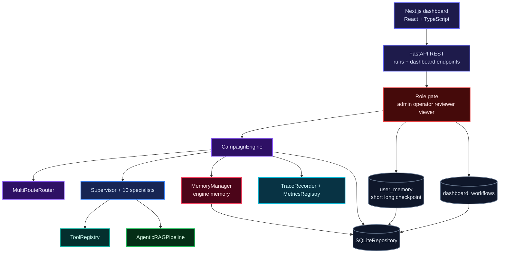
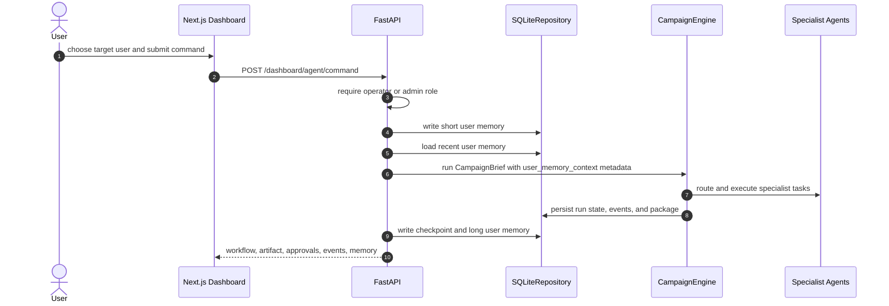

# Agentic Marketing Swarm Architecture

Updated: June 2026.

Agentic Marketing Swarm is a local-first campaign orchestration project with a FastAPI backend, a Next.js dashboard, a checkpointed agent engine, local retrieval, local memory, guardrails, observability, and deterministic evals. It is intentionally free to run by default: no required API keys, business account, hosted auth, paid vector database, managed queue, or cloud database.

## System Plane

**System Plane.** The dashboard is the human command surface. FastAPI receives commands, applies lightweight role checks, writes dashboard memory, and forwards normalized briefs to `CampaignEngine`. The engine owns routing, checkpointing, policy decisions, specialist execution, retrieval, package synthesis, and event persistence.

## Dashboard Command Sequence

**Dashboard Command Sequence.** A dashboard command always starts with short memory, so the immediate user intent is recorded before the agent workflow runs. After completion or pause, checkpoint memory links the user to the run boundary, and long memory stores reusable summary context.

## Design Contracts

| Contract | Enforced By | Effect |
|---|---|---|
| Typed briefs, tasks, routes, handoffs, results, users, memory records, and packages | Pydantic schemas in `src/marketing_swarm/schemas/` | Invalid state fails before it contaminates a run |
| Role-aware command surface | `require_role()` dependency and dashboard headers | Viewers/reviewers inspect; operators/admins command and write memory |
| User memory remains local | `user_memory` SQLite table | Multi-user continuity without hosted profile storage |
| Retrieval stays local by default | Hashing vectors, BM25, SQLite knowledge chunks | Campaign generation can run without paid search or external storage |
| Tool failures are structured | `ToolResult` and `FailureStamp` | Orchestration can distinguish tool, policy, model, validation, and infrastructure errors |
| QA cycles are bounded | `QualityPolicy` and `qa_revision_limit` | Revision loops cannot run forever |
| Evals use deterministic provider | `FakeProvider` and `EvalHarness` | CI gates remain reproducible without a live model runtime |
